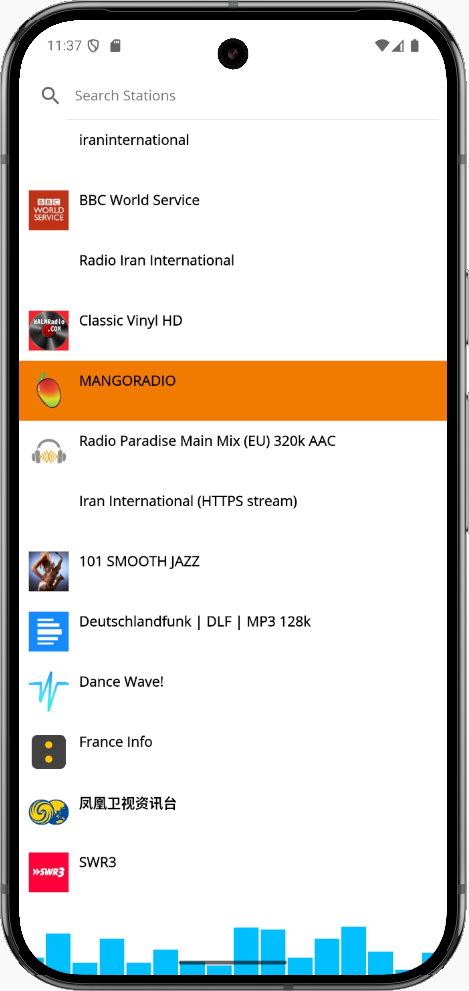

# net_radio

A cross-platform .NET MAUI radio streaming app that lets you browse, search, and play internet radio stations. Features a modern UI, animated audio visualizer, and search by station name or tags.

## Features

- Browse top internet radio stations (powered by [Radio Browser API](https://www.radio-browser.info/))
- Search stations by name or tags
- Play live radio streams with background audio support
- Animated audio visualizer while playing
- View station details (name, favicon, tags)
- Android, iOS, Windows, and MacCatalyst support
- Modern .NET MAUI UI and MVVM architecture

## Screenshots

net_radio/
├── App.xaml.cs
├── MainPage.xaml
├── MainPage.xaml.cs
├── MauiProgram.cs
├── Models/
│   └── RadioStation.cs
├── Services/
│   └── RadioBrowserService.cs
├── ViewModels/
│   └── RadioViewModel.cs
├── Views/
│   └── AudioVisualizerView.cs
├── Platforms/
│   └── Android/
│       ├── AndroidManifest.xml
│       ├── MainActivity.cs
│       ├── MainApplication.cs
│       └── Resources/
│           ├── values/
│           │   └── colors.xml
│           └── xml/
│               └── network_security_config.xml

## Getting Started

### Prerequisites

- [.NET 8 SDK](https://dotnet.microsoft.com/download)
- Visual Studio 2022 (with .NET MAUI workload)

### Setup

1. **Clone the repository:**

## License

This project is licensed for **non-commercial use only** under the [Custom Non-Commercial License](LICENSE).

For commercial use, please contact me at me@mrstevenpalmer.com to obtain a commercial license.